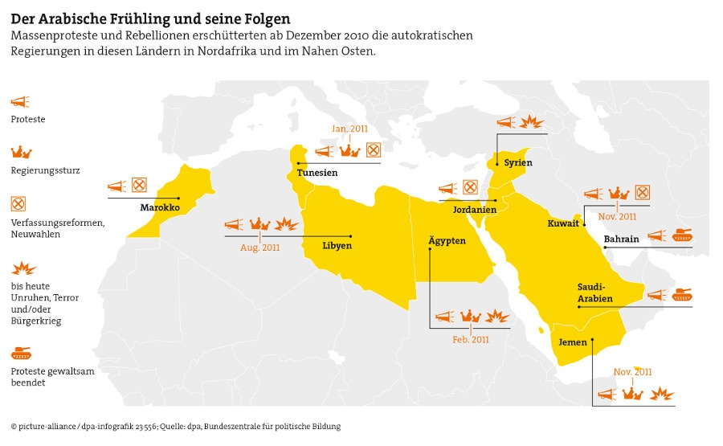

\newpage

\listoffigures

```{r setup, include=FALSE}
knitr::opts_chunk$set(echo = FALSE, message = FALSE)
# install.packages("tidyverse")
# install.packages("rvest") # will also install required package xml2
# install.packages("lubridate")
# install.packages("wesanderson")
library(tidyverse); library(lubridate); library(wesanderson)
```

\newpage 

# To Do (include points based on literature)

- structure of the economy / factor endowment
    - determines who easy it is to repress / redistribute
    - landowners are easier to tax because they cannot move their capital
    - landowners are on average richer than capitalists
- globalization
- which institutions are in place? What is their nature? (de facto, de jure) confer Why nations fail 
- Collective Action Problem (!) 
    - In the Arab Spring, it was solved also by social media, cf. Acemoglue 2018 Evidence from Arab Spring
- Cost and Benefits of Rev / Concessions
    - GDP per capita
    - GDP according to factor endowment
    - Unemployment per group which participated in the revolution -> no decrease for unemployment of the youth population -> hard to find evidence
    - Problematic of finding evidence?
    - Groups (demostrants, military, ...)
    - political identities
    - Reliance on export -> instability (Diversitfiation )
- international trade: dependence on international trade
    
    
- Fragen spezifizieren
- general weakness of civil society 
- institutions (does an opposition exist?)


# Introduction: Problem Statement & Hypotheses

Economic aspects have been one of the main explanations for the political unrest during the Arab Spring used not only by many scholars, but also used by the media. The Economist's "Shoethrower's Index" is a noteworthy example. Youth population, years of government in power, corruption, GDP per capita, and several other indicators were assumed to measure the Arab countries’ vulnerability for a revolution.[^shoethrower_link] 
It turns out that the potential for unrest in the Arab world 2010 were highest in Yemen, Libya, Egypt and Syria, while countries like Qatar, Kuwait, United Arab Emirates and Lebanon had the lowest scores (The Economist 2011:26). Even though the index lacks of theoretical backing, not only its predictions of social unrest are empirically supported (see Appendix[^appendix] of this Paper). The scientific literature supports some of the indicators used by the Economist (see Chapter). The observation that the economic situation is seems to be a suitable indicator for social unrest is the starting point of this paper. 

[^shoethrower_link]: http://www.geocurrents.info/geopolitics/the-economists-shoe-throwers-index-a-success

However, the motivation is to study the economic origins and outcomes of the Arab Spring from the perspective the more systematic approach of Acemoglu and Robinson's [-@acemoglu2006origins] "Economic Origins of Dictatorship and Democracy". Their account provides a theoretical framework for analyzing the creation and consolidation of different political institutions from a game theoretical perspective. It implies strategical behavior of social groups with respect to the way they allocate political power and resources. Democracy, on the one hand, is preferred by the majority of citizens due their gain of political influence on how ressources are distributed in a society. On the other hand, autocratic regimes are preferred by the elites because ressources and power are centered among few individuals. The question under which conditions these regime changes occur and consolidate is interesting both theoretically and empirically. The focus of this paper is to relate Acemoglu and Robinson's [-@acemoglu2006origins] theoretical account to empirical findings on economic origins and outcomes of the Arabic Spring from existing literature and key economic indicators taken from the World Bank's database. More specificly, the interest of this paper is twofold: 

1. Does the degree of inequality correspond to the severeness of revolutionary movements? Acemoglu and Robinson's framework suggest that only with a sufficiently high economic incentive the poor can solve the collective action problem. In other words: In countries with higher economic welfare accuring to the poor, policital concessions by the incumbent regime were effective to calm down social unrest. In the contrary, lower economic welfare should be related to a higher degree of social unrest (local protests, nationwide protests, regime changes). 
2. What are the economic consequences of a revolution? In the model of Acemoglu and Robinson individuals behave strategically under the conditions of complete information. It follows, that successful regime transitions towards more democratic political institutions should be related to higher share of available ressources accuring to the poor in the years after the revolution. (Successfull: Tunesia, Unsucessful: Egypt, ...)

Since were are not in the domain of controlled experiments we cannot replay the dynamics of the Arabic Spring as if the regime changes and the political or economic concessions did not happen. Therefore, this paper can neither trace back the emergence of regime critical movements to specific economic conditions before the revolution nor explain the economic developments as the result of the events of the Arabic Spring. Still, this interpretative approach provides evidence for Acemoglu and Robinson's theoretical framework that can be put to test with a more elaborated methodological approach.

[^appendix]: The appendix of this paper contains an overview of the major events and outcomes of the Arab Spring for each country provided by the "Bundeszentrale für politische Bildung", a federal public authority providing citizenship education and information on political issues for all people in Germany.

\newpage


<!-- # Literature -->

<!-- According to Acemoglu and Robinson [-@acemoglu2006origins] regime transitions and their consolidation depend on political and economic crises, the strenght of civil society, political institutions, the level of economic inequality, the structure of the economy and the form and extent of globalization. The purpose of this section is to review existing literature on the Arabic Spring in order to identify preconditions and outcomes of the Arabic Spring. -->

<!-- ## Preconditions -->

<!-- - Economic impoverishment of the majority of the people -->
<!-- - Deteriorating food security and living standards (Breisinger et al. 2011) -->
<!-- - High rates of unemployment, especially among the youth population (Salih 2013: 187; Hoffman and Jamal 2012: 169f, 184f).  -->
<!-- - Lack of economic free in these countries. The government policies required tremendous administrative steps to set up a formal business (Martin 2012: 94f).  -->

<!-- - The economic impoverishment of the majority of the people, staggering food prices, high rates of unemployment, and especially among the large youth population - are all regarded as plausible roots and causes for the Arab Spring (Salih 2013:187).  -->
<!-- - Especially the deteriorating food security and living standards in the region is said to have led to the uprisings (Breisinger et al. 2011). Another article focuses on the youth population and discusses the Arab Spring in terms of a “youth revolution”.  -->
<!-- - The high unemployment among the young people in this region is seen as a major problem, with youth unemployment as high as 80 % in some areas. The overall conclusion is that frustration with the lack of jobs makes the youth population more prone to protest (Hoffman & Jamal 2012:169f, 184f).  -->
<!-- - Emmanuel Martin claims that one of the more forgotten causes for the Arab Spring was the lack of economic freedom in these countries. The government policies required tremendous administrative steps to set up a formal business, which Martin sees as a part of the political oppression and authoritarianism in these countries (Martin 2012:94f)." from [@carbonnier: 17 f.] -->


<!-- ## Outcomes -->

<!-- ## Minor changes  -->

<!-- Almost at the same time as in Egypt, protests broke out in **Jordan** on January 21, 2011 (UCDP 2011). The protesters were demanding cuts in food and fuel prices, electoral reforms, and more power granted to the parliament. There were, as well, complaints about rampant poverty, high unemployment, and corruption in the country. King Abdullah II, in response, replaced his prime minister, and formed two commissions to study possible electoral reforms and constitutional amendments. He did as well offer a $125 million package of subsidies for fuel, sugar, and other products. There have been occasional violent demonstrations in Jordan, but so far the government’s concessions have managed to keep off most instability, leaving king Abdullah II still in power (BBC 2012; Jones 2013; Helfont & Helfont 2011; Miller 2011:34). -->

<!-- **Lebanon** faced a different sort of demonstrations amid the Arab Spring. While the key slogan in Egypt and Tunisia had been "The people wants to topple the regime", the protest movement in Lebanon adopted a slightly different slogan, "The people wants to topple the sectarian regime". On 27 February 2011, the anti- sectarian movement, as it was referred to, held its first demonstration. The protests were not as much directed against the president, the prime minister or the government, but it was believed that the symbols of powers were located outside the official state institutions (Hermez 2011). However, the movement failed to attract a significant numbers of participants, and in spite of repeated calls, few people showed up for the demonstrations (Khashan 2011). -->

<!-- **Morocco** saw its first protest on February 20, 2011, and demonstrations soon spread and sprung up in over 50 cities (Badimon 2013:207; Miller 2011:36). On March 9, 2011, King Mohammed VI held an extraordinary televised speech to the Moroccan people, in which he promised "a new charter between the throne and the people" and outlined a so called “package of comprehensive constitutional amendments”. The new constitution was to guarantee rule of law and an enhanced role for the prime minister, in practise it would reduce the king’s power and increase that of the elected government. On June 17, 2011, the new constitution was released and in a referendum two weeks later it was passed (Traub 2012:43; Maddy-Weitzman 2012). Whether the concessions done by the Mohammed VI were sincere and will ultimately lead to a political system in line with a constitutional monarchy, is yet to be seen. It is still safe to say that Morocco did not face the same turmoil and uprisings as other countries during the Arab Spring. -->

<!-- ## Major changes -->

<!-- In January 2011, protests broke out in Egypt. After eighteen days of protests in Cairo and in other cities, President Hosni Mubarak was forced to step down on February 11, 2011. This ended Mubarak’s 30 years of power in Egypt. According to the Egyptian government fact-finding panel, 846 people were killed and more than 6,400 were injured during the uprisings. (BBC 2012; Salih 2013:193). -->

<!-- As mentioned in the introduction, the protests in Tunisia began on December 18, 2010. This was sparked by the self-immolation of the vegetable seller Mohamed Bouazizi in the city of Sidi Bouzid. This was done as a political protest. Pro-democratic and anti-regime protests rose up across Tunisia, in what came to be known as the “Jasmine Revolution”. In the violent clashes around 300 people died during the unrest. President Zine el-Abidine Ben Ali was toppled, after 23 years in power, on the January 14 2011 (BBC 2012; Schraeder & Redissi 2011). -->

<!-- In Yemen demonstrations started on January 27, 2011, calling for the end of president Ali Abdullah Saleh’s 33-year rule. The president announced at a very early stage that he would not seek re-election and that he would not pass over power to his son. However this did not stop the protests, which became more frequent and widespread. It was also met with a deadly crackdown by the security forces and supporters of the president. In April 2011, Saleh refused to sign a GCC-brokered deal to hand over power in return for immunity from prosecution. This prompted the head of the Hashid tribal federation, Sheikh Sadiq al-Ahmar, to declare his support for the opposition. Heavy clashes between security forces and armed tribesmen occurred in the capital Sanaa, leaving dozens of people dead. In June, president Saleh was seriously injured by a bomb explosion and was forced to leave the country to seek medical treatment. He returned to Yemen in September amid a new wave of violence. In October 2011, the UN Security Council urged the president to agree to the GCC-brokered deal. President Saleh signed the deal November 23, and formally ceded power two days later (BBC 2012; Salih 2013:193-195). -->


<!-- Their model suggests that regime changes are likely to occur when citizens can threaten social disorder.  -->

<!-- These transitions consolidate when when elites do not have strong incentives to interfere.  -->

<!-- The argument of economic incentives equally applies to the elite's preference of non-democratic regimes.  -->


<!-- On the other hand, Dictatorship nevertheless is not stable  In response, when the costs of repression are sufficiently high and promises of concessions are not credible, elites may be forced to create democracy. By democratizing, elites credibly transfer political power to the citizens, ensuring social stability. Democracy consolidates when elites do not have strong incentive to overthrow it. These processes depend on (1) the strength of civil society, (2) the structure of political institutions, (3) the nature of political and economic crises, (4) the level of economic inequality, (5) the structure of the economy, and (6) the form and extent of globalization." (from book description of EOoDaD) -->

<!-- This Term Paper article focusses on the fourth aspect: the level of economic inquality. (Mention no evidence for the relation of increasing income and changes in democracy.) In the model of Acemoglu and Robinson [-@acemoglu2006origins] inter-group inequality and revolutions are related by the possible outcomes of a regime-critical movement. In non-democracies citizens obtain only a small fraction of available resources. With a revolution there is a chance the share the income of the economy minus the what is destroyed. In other words: Does the degree of inequality correspond the severeness of revolutionary movements? -->

 


<!-- "Economic Origins of Dictatorship and Democracy" proposes a game theoretical account that implies strategical behavior with respect to political unrest. There are three cases of a revolution:  -->

<!-- - "If the fraction of what will be destroyed in a revolution is larger than the share of the income of the rich, the tax rate will be zero and there will not be a revolution. -->
<!-- - If the fraction of what will be destroyed in a revolution is smaller than the share of income of the rich and this fraction is smaller than what the poor will get when the elite employs a tax rate according to the preferences of the poor, there still will be a revolution. -->
<!-- - If the fraction of what will be destroyed in a revolution is smaller than the share of income of the rich and this fraction is larger than what the poor will get when the elite employs a tax rate according to the preferences of the poor, the elite will employ a tax rate that prevents a revolution and therefore, there will only be a revolution if that tax rate is lower than the one preferred by the poor and there will not be a revolution if the elite employs a tax rate that is higher/equal to the tax rate preferred by the poor." (from slides ) -->


```{r costum functions}

tidy_worldbank_data <- function(.dataframe){
  
  df <- .dataframe %>% 
    rename_all(~ str_replace(., ' ', '_') %>% str_remove('[0-9]{4}_\\[YR') %>% str_remove('\\]$')) %>% 
    mutate(Country_Name = Country_Name %>% str_remove("(n )?(, )?(Arab )?Rep.(blic)?")) %>% 
    select(Country_Name, Country_Code, Series_Name, matches('[0-9]{4}')) %>% 
    na_if('..') %>% 
    mutate_at(vars(matches('[0-9]{4}')), as.numeric) %>%
    gather(Year, value, - Country_Name, - Country_Code, - Series_Name) %>% 
    mutate(Year = paste(Year, "-01-01") %>% lubridate::ymd())
  
  return(df)
}


plot_worldbank_data <- function(.dataframe, .outcomes_df){
  
  country_names <- .outcomes_df %>% pull(Country_Name)
  
  arab_countries <- data_frame(
    # countries mentioned in the context of arab spring 
    countries = country_names, 
    # define costum colors for plot and rearrange their order of appearance
    colours =  c(wes_palette("Darjeeling1")[c(1,2,4,5)], 
                 wes_palette("Darjeeling2")[1:4], 
                  
                 wes_palette("IsleofDogs2")[3],
                 wes_palette("IsleofDogs1")[1],
                 wes_palette("Cavalcanti1")[4],
                 wes_palette("FantasticFox1")[2], # snake yellow
                 wes_palette("Moonrise3")[c(2,4)], # douce pink, douce olive
                 wes_palette("GrandBudapest1")[2], # magenta
                 wes_palette("FantasticFox1")[5] # dark red 
                 )[1:length(country_names)]
  )
  
  # with gather() the last column contains the value
  value_col <- ncol(.dataframe)

  # prepare dataframe to plot 
  # join details countries that correspond to the countries in manually collected data
  more1_observation <- .dataframe %>%
    filter(str_detect(Country_Name, paste0(country_names, collapse = "|")), 
          !is.na(.dataframe[value_col])) %>% 
    left_join(.outcomes_df %>% select(-Country_Name) , by = "Country_Code")
  
  # define x and y coordinates of plot according to the time of the event
  plot_coordinates <- data_frame(
    xmin = min(timeline$Date),
    xmax = max(timeline$Date),
    ymin = min(more1_observation[value_col], na.rm = T),
    ymax = max(more1_observation[value_col], na.rm = T)
  )
  
  # indicate area of major events of arab spring in plot
  aesthetic_layers <- list(
    geom_rect(inherit.aes = F,
              data = plot_coordinates,
              fill = "red",
              alpha = 0.2,
              mapping = aes(xmin = xmin, xmax = xmax,
                            ymin = ymin, ymax = ymax)),
    geom_text(inherit.aes = F,
              aes(x = xmin + (xmax - xmin) / 2, y = ymin),
              label = "Major Events of Arab Spring",
              angle = 90, vjust = 0.36, size = 3.1, hjust = -0.5,
              data = plot_coordinates,
              alpha = 0.7),
    scale_x_date(limits = c(min(more1_observation$Year), 
                            max(more1_observation$Year)),
                 labels = scales::date_format("%Y"),
                 breaks = '2 years'), 
    scale_colour_manual(values = setNames(as.character(arab_countries$colours),
                                          arab_countries$countries)),
    xlab("Year"),
    ylab(unique(.dataframe$Series_Name)),
    labs(color = "Country", shape = "Outcome"),
    theme_minimal()
  )
  
  plot <- ggplot(more1_observation,
                 aes_string(x = "Year", y = names(.dataframe[value_col]),
                            color = "Country_Name", 
                            shape = "Overall_Consequences")) +
    geom_point(size = 1.5) +
    geom_line() +
    aesthetic_layers 
  
  return(plot)
  
} 

```

```{r get wikipedia data, eval=FALSE}
# download infobox from wikipedia that provides a timeline of major events 
timeline <- xml2::read_html('https://fr.wikipedia.org/wiki/Printemps_arabe') %>% 
  rvest::html_nodes(xpath = "//div[@class='infobox_v3']/table") %>% 
  map(~ rvest::html_table(., fill = T)) %>% 
  `[[`(2) 

# save file  
# saveRDS(wiki_infobox, paste0("wiki_fr_timeline", Sys.Date(), ".rds")) 
```

```{r get googlesheet, eval=FALSE}
# googlesheets::gs_ls() 

googlesheets::gs_auth()

outcomes_df <- googlesheets::gs_key("1HcxeQTFjCeNM5yWhh94XMLUVzj7GaL4F8Hjqwy8tOys") %>% 
  googlesheets::gs_read() %>% 
  filter(!is.na(Overall_Consequences))

# save file  
# saveRDS(outcomes_df, paste0("../gsheet_outcomes_", Sys.Date(), ".rds")) 


```


```{r load data}

outcomes_df <- readRDS('../gsheet_outcomes_2018-11-11.rds') %>% 
  filter(!is.na(Overall_Consequences))


# wikipedia data on major events of the Arab Spring
timeline <- readRDS("../wiki_fr_timeline2018-11-08.rds") %>% 
  rename(Date = X1, Event = X2) %>% 
  mutate(Date = lubridate::dmy(Date, locale = "fr_FR"), 
         Event = Event %>% str_remove('Début d[ue] (l[ae])?'))

# load world bank data 
wb_data <- list.dirs(path = "../WorldBankData", full.names = T) %>% 
  list.files(full.names = T, pattern = "Data.csv") %>% 
  map_df(~ read_csv(.) %>% tidy_worldbank_data()) 
 
```


```{r include bpb infographic}

```

\newpage

```{r timeline, fig.cap="Events and Outcomes of the Arab Spring", eval=FALSE}
timeline %>% knitr::kable()
```

# World Bank Data


<!-- ## Inequality -->

<!-- The subsequent graphics provide evidence that economic incentives are a driving force of revolutionary movements. In those countries with lower economic welfare (total unemployment, youth unemployment, GDP per capita ?, income share ?) concessions by the incumbent were effective. In the context of the model of Acemoglu and Robinson's the thread of revolution was not credible because of higher economic welfare compared to other Arabic countries. -->


```{r plot gini index over years with major events, fig.cap=details_gi %>% pull(2)}

details_gi <- read_csv("../WorldBankData/world_bank_gini/Definition and Source.csv")

wb_data %>% 
  filter(Series_Name == "GINI index (World Bank estimate)") %>% 
  plot_worldbank_data(outcomes_df) 

```


## Inequality


- Commitment problem: In Egypt inequality decreased after the events of the regime change but again increased afterwards
- Only one more observation that allows comparing before and after the political unrest: in Morocco there was no major change regarding inequality


```{r plot unemployment total, fig.cap=details_ut %>% pull(2)}

details_ut <- read_csv("../WorldBankData/Unemployment_percent_of_total_labor_force/Definition and Source.csv") 

no_change_over_time <- wb_data %>% 
  filter(Series_Name == "Unemployment, total (% of total labor force) (modeled ILO estimate)",
         !is.na(value)) %>% 
  group_by(Country_Code) %>% 
  summarise(sd = sd(value), 
            mean = mean(value)) %>% 
  filter(
    sd < 0.3
    #mean > 0.8
    )

wb_data %>% 
  filter(Series_Name == "Unemployment, total (% of total labor force) (modeled ILO estimate)") %>% 
  anti_join(no_change_over_time, by = "Country_Code") %>% 
  plot_worldbank_data(outcomes_df) + 
  ylab("Unemployment, total (% of total labor force)")

```

## Unemployment

- Tunesia: unemployment decreases
- Cost of Revolution: The result of the Arab Spring is a higher unemployment rate except for Morocco, Bahrain and Yemen the Arab
- Strongest increase in case of Syria, Tunesia (and Libya)
- Group differences: In those countries with lower unemployment concessions were made. 

\newpage

```{r plot youth unemployment, fig.cap=details_yu %>% pull(2)}

details_yu <- read_csv("../WorldBankData/Youth_unemployment_percent_youth_population/Definition and Source.csv") 

wb_data %>% 
  filter(Series_Name == "Share of youth not in education, employment or training, total (% of youth population)") %>% 
  plot_worldbank_data(outcomes_df) +
  ylab("Youth unemployment (% of youth population)")

```


- Explanation of social unrest: As supported by other sources younger population of Egypt suffered from high unemployment compared to the overall unemployment.
- Concessions and lower unemployment: Cost of revolution too high respectively economic incentive too low? 

\newpage

```{r plot other taxes, fig.cap=details_ot %>% pull(2)}

details_ot <- read_csv("../WorldBankData/Other_taxes_percent_of_revenue/Definition and Source.csv") 

wb_data %>% 
  filter(Series_Name == "Other taxes (% of revenue)") %>% 
  plot_worldbank_data(outcomes_df)

```

- Definition: `r details_ot %>% pull(3)`
- increased in Egypt

\newpage


## Taxes (not necessarily related to the rich / poor)

```{r plot taxes on income profits and capital gains, fig.cap=details_toipacg %>% pull(2)}

details_toipacg <- read_csv("../WorldBankData/Taxes_on_income_profits_and_capital_gains_percent_of_revenue/Definition and Source.csv") 

wb_data %>% 
  filter(Series_Name == "Taxes on income, profits and capital gains (% of revenue)") %>% 
  plot_worldbank_data(outcomes_df) 

```


- in case of Egypt, Bahrain and Tunesia tax rate increases with political unrest compared to period before
- in case of Jordan and Morroco the tax rate declines
- not necessarily correlated with policital unrest: state could impose higher taxes due to the costs of the revolution also on the elites
- taxation that affects especially the rich population? `r details_toipacg %>% pull(3)`

\newpage


```{r plot taxes on international trade, fig.cap = details_toit %>% pull(2)}

details_toit <- read_csv("../WorldBankData/Taxes_on_international_trade_percent_of_revenue/Definition and Source.csv")

wb_data %>% 
  filter(Series_Name == "Taxes on international trade (% of revenue)") %>% 
  plot_worldbank_data(outcomes_df) 


```


- Cost of revolution: Taxes on international trade increased in the subsequent years after the initial events of the Arabic Spring
- Concessions and international trade


```{r customs and other import duties, fig.cap=details_caoid %>% pull(2)}

details_caoid <- read_csv("../WorldBankData/Costums_and_other_import_duties_percent_of_tax_revenue/Definition and Source.csv") 

wb_data %>% 
  filter(Series_Name == "Customs and other import duties (% of tax revenue)") %>% 
  plot_worldbank_data(outcomes_df)
```


- Definition: `r details_caoid %>% pull(3)`

\newpage


<!-- Notes:  -->

<!-- - Nahen Osten. In fast allen Ländern der Region kam es zu spontanen Demonstrationen, die sich in einigen Staaten zu breiten Protestbewegungen gegen die jeweiligen Regime ausweiteten und die autoritär herrschenden Präsidenten in Tunesien, Ägypten, Libyen und im Jemen stürzten. In den meisten Ländern wurden in der Folge – wenn auch oft nur kosmetische – Reformen durchgeführt. Über fünf Jahre später lässt sich leider nur eine ernüchternde Bilanz des Arabischen Frühlings ziehen, denn kaum eine mit ihm verbundene Erwartung erfüllte sich. Weder kam es zu einer breiten Demokratisierung in der Region, noch gelang es – mit Ausnahme Tunesiens –, verfassungsmäßig garantierte und staatlich geschützte Freiheitsrechte durchzusetzen. Die soziale und wirtschaftliche Lage hat sich in den meisten Ländern weiter verschlechtert, und fast alle autoritären Regime konnten ihre Herrschaft nach einer Phase der Unsicherheit erneut festigen. Mit einer Mischung aus Zuckerbrot und Peitsche, aus partiellen Reformen, finanziellen Vergünstigungen, dem Einsatz von Überwachungstechnologie und staatlicher Repression bis hin zu gewaltsamer Unterdrückung gelang es den Autokraten, die heterogenen Oppositionsbewegungen zu kooptieren, zu spalten, einzuschüchtern und zu unterwerfen. Einzig in Tunesien kam es zu einem Regimewechsel, der in einen anhaltenden, aber keineswegs unumkehrbaren Demokratisierungsprozess mündete. -->


<!-- Context:  -->

<!-- - Timur Kuran [@kuran2004] discusses the question why the Middel East is relatively underdeveloped in the context of institutions -->
<!-- - The introduction of "Why Nations Fail" [@acemoglu2012nations] provides a compact summary of the main events of Egypt's Arabic spring -->

<!-- Case Study:  -->

<!-- - "The Power of the Street: Evidence from Egypt’s Arab Spring" is an empirical investigation of the question how change in political power affects economic outcomes [@acemoglu2018arabic]. -->


<!-- # Arab Spring -->

<!-- from [@carbonnier] -->

<!-- This chapter offers a brief introduction and overview of the Arab Spring, and the six selected countries for this study. It starts off with an introduction of the Arab Spring, with a general regional introduction, and then continues with each individual country. This introduction only covers the period of time from the beginning of the Arab Spring in December 2010, through the subsequent year of 2011. -->

<!-- - Reason for the selection of six countries? -->

<!-- The Arab Spring, or the Arab uprisings, represents a revolutionary wave of demonstrations and protests that swept through the Arab world. It started off with protests in Tunisia on December 18, 2010, following Mohamed Bouazizi’s self-immolation in protest of ill-treatment and police corruption (Salih 2013:184). This triggered protests in Tunisia, and in January 2011 the Tunisian president Zine el- Abidine Ben Ali was overthrown (Mabon 2012:531). The waves of protests did not stop there, soon the protests spread into the neighbouring Algeria, and broke out in Egypt and Jordan in January 2011. By February 11 violent clashes forced Hosni Mubarak to step down and end his 30-years of power in Egypt (Helfont & Helfont 2011:83). Waves of protests continued to develop throughout the Arab world. Protests emerged in Bahrain, Morocco, Yemen, Jordan, Oman, Saudi Arabia, and Lebanon, as well as Kuwait, Palestine, Iran and Iraq. The Arab Spring left hardly any country unaffected. Civil war broke out in Libya and Syria, where Libya’s Muammar al-Qaddafi was removed from power, whereas in the case of Syria the civil war is still ongoing (Jones 2013:1; Dupont & Passy 2011:447; Blight et al. 2012). Many of the demonstrations during the Arab Spring were also met with a violent response from the authorities, as well as from pro-government militias and counter-demonstrators (Salih 2013:184). -->

<!-- - On February 11 Mubarak was forced to step down, compare to timeline  -->


<!-- # Conclusion -->

<!-- Also beyond the scope / for further research as done by [@carbonnier]:  Moreover, they assume that the inter-group inequality is related to the set of political institutions because an effective thread of revolution initiates the democratization process. Democratization implies a higher influence of the people on the redistribution of the income of an economy. It follows that democratization is attractive for citizens and costly for the elites. In this sense Acomoglu and Robinson emphasize social conflicts between groups as driving force of democratization. -->

<!-- \pagestyle{fancy} -->
<!-- \fancyhf{} -->
<!-- \fancyhead[L]{Appendix} -->
<!-- \fancyfoot[L]{\thepage} -->

<!-- \includepdf[pages={-},scale=0.85,pagecommand={\pagestyle{fancy}}]{../Figures/Naher_Osten_S76.pdf} -->


# Literature


